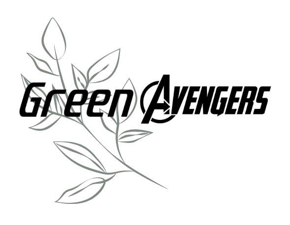
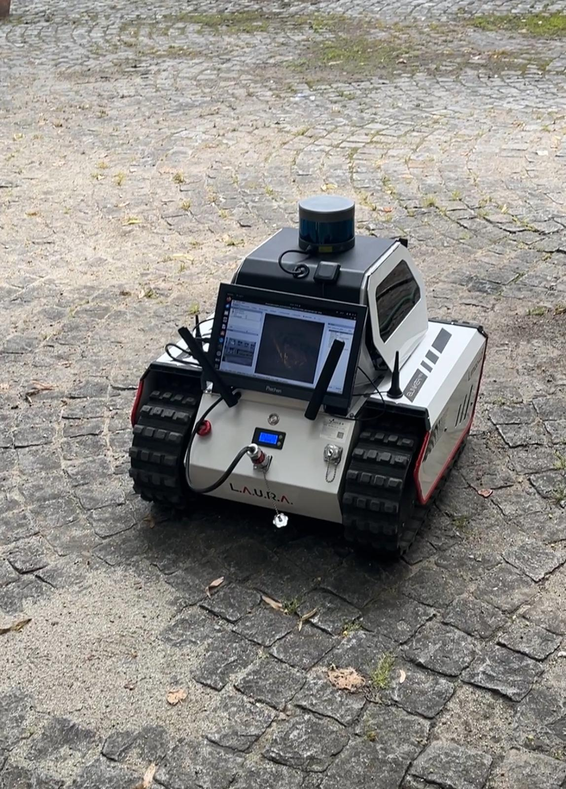
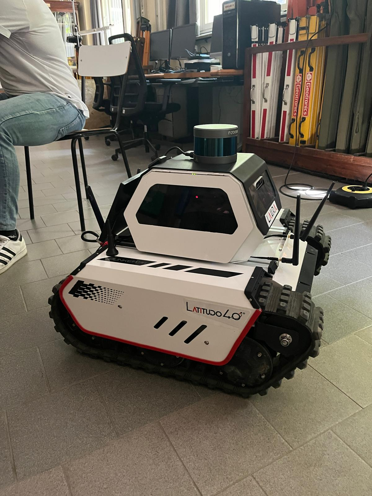
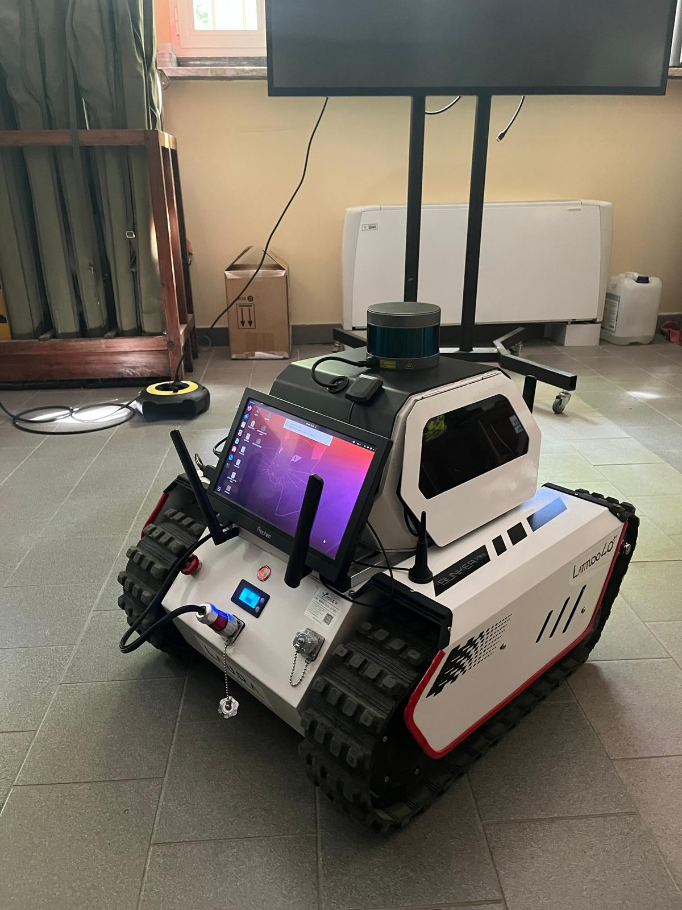
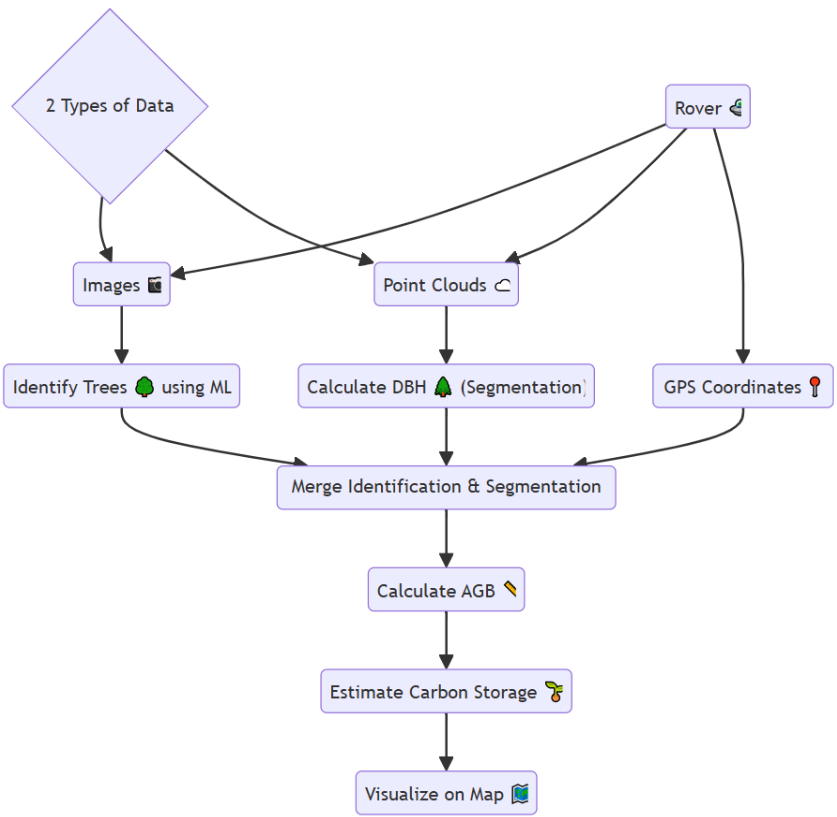
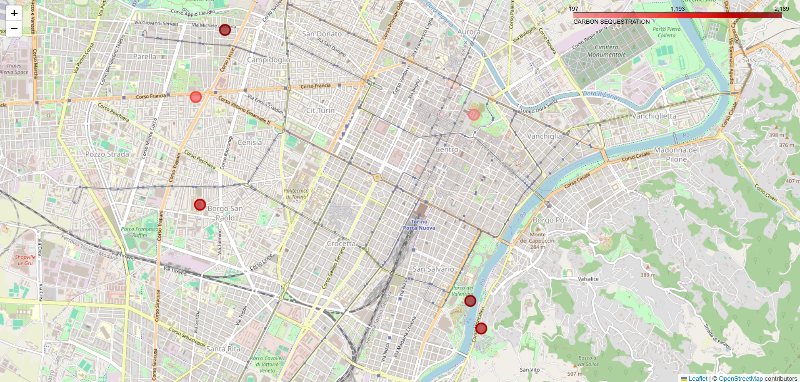

# Challenge_Latitudo40
The Implementations and the codes of the Challenge course by Latitudo40 Firm

## Team Green Avengers

  

## Project Overview

### Description of the Problem

#### The Problem That the Challenge Proposes
The challenge "ForestNav: Autonomous Carbon Storage Mapping for Climate Change Mitigation," proposed by the firm Latitudo40, aims to enhance the on-board systems of an existing ground rover. Its primary objective is to estimate Above Ground Biomass (AGB) through the elaboration of data gathered from both on-board sensors and satellites. AGB plays a crucial role in the carbon cycle, serving as a substantial reservoir of carbon absorbed from the atmosphere via photosynthesis. Accurately estimating AGB is vital for comprehending an ecosystem's carbon storage capacity, evaluating forest resources, and effectively managing carbon sequestration efforts to mitigate climate change. Our primary focus is to develop an innovative method to use ground data to estimate AGB values, enabling us to predict the amount of carbon storage related to an area.

#### The Rover Details (LAURA)
There is a stereo camera consists of two horizontally aligned RGB lenses, enabling depth perception by superimposing the two images to produce 3D pictures. LiDAR (Light Detection and Ranging) is a remote sensing technology that measures distances to objects or surfaces using laser pulses. This data is used for real-time 3D mapping of targeted areas and for object detection. LiDAR is highly valued for its accuracy, efficiency, and ability to capture detailed spatial information, making it applicable in geomatics, forestry, autonomous navigation, and environmental monitoring. The sensor currently mounted on the Laura rover provides 360-degree environmental scanning capabilities, enabling fast and accurate mapping and detection of nearby objects.

Communication with Laura can be established via WiFi or LAN cable. Movements can be directly controlled using a radio-controller or through ROS (Robot Operating System) via a specifically designed keyboard. ROS includes a 3D visualizer called RViz, which allows real-time monitoring of images acquired by the visual sensors (LiDAR and stereo camera) from Laura’s display.

What distinguishes Laura is its flexibility, allowing the integration of additional sensors to enhance data collection capabilities and improve data precision. This versatility ensures that Laura can effectively gather comprehensive data across various environments, making it a crucial tool for scientific research and environmental monitoring. Laura has already been tested in a vineyard environment, where it was remotely controlled to monitor the health status of the vegetation. The next steps involve the implementation of autonomous navigation algorithms to replace remote control, improving existing equipment to increase efficiency and expand usability, and automating data management and interpretation, which is currently performed manually. Our team has primarily focused on the last aspect, aiming to enhance the overall functionality and application of the Laura rover.

  
  
  

### Solution Proposed By Our Team
Our project involves an innovative approach to studying trees in the field using advanced data collection and 
processing techniques. We utilize a Rover equipped with a GPS sensor to gather both image and point cloud 
data. The primary goal is to calculate the Diameter at Breast Height (DBH) and estimate the Above-Ground 
Biomass (AGB) of trees to assess their carbon storage potential.

The process begins with the collection of images and point cloud data. The images are processed using a 
machine learning algorithm developed with PyTorch, which involves two phases: training and identification. 
For training, we use a database of images for specific tree species such as Horse Chestnut, European Red Pine, 
and European Nettle Tree. Each species has approximately 200 training images and 15 validation images. The 
dataset is normalized using its mean and standard deviation, followed by preprocessing steps like resizing, 
random flipping, and rotating the images. 

Once preprocessing is complete, the training process begins. In the identification phase, the algorithm classifies 
images acquired in the field, identifying tree species and returning metadata such as geographical coordinates. 
This ensures the correct allometric equations are automatically selected for each tree species, enhancing the 
efficiency of LiDAR data collection.

Using unsupervised learning techniques and point cloud manipulation, we calculate the DBH of each tree. The 
point cloud data, segmented for this purpose, provides accurate measurements necessary for this calculation. 
Following the DBH estimation, we use allometric equations, derived from research in Bhutan and the USA, to 
estimate the AGB of various tree species, including urban trees like Beech and European Red Pine. 

After estimating the AGB, we calculate the carbon storage for each tree, which is essential for understanding 
the ecosystem's carbon sequestration potential. We further explore the relationship between the Normalized 
Difference Vegetation Index (NDVI) and AGB, drawing on studies from Malaysia and Alaska. These studies 
have shown moderate to strong correlations, highlighting the utility of NDVI in assessing and monitoring 
forest biomass and health. 

Finally, the data is visualized on a map to identify areas with varying levels of carbon storage. This 
visualization aids in understanding and managing environmental conditions effectively, supporting 
conservation and carbon management efforts. This comprehensive approach enables informed decisionmaking for better conservation and sustainable practices.

#### FlowChart of our Process

  

### Sample Output

